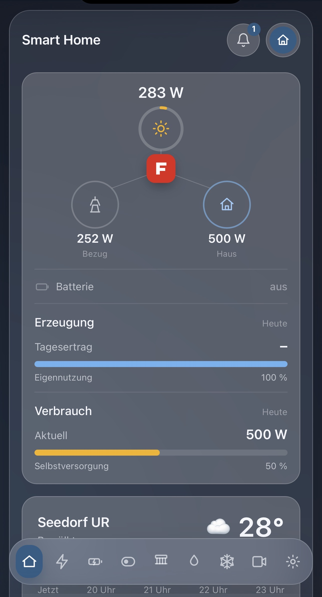
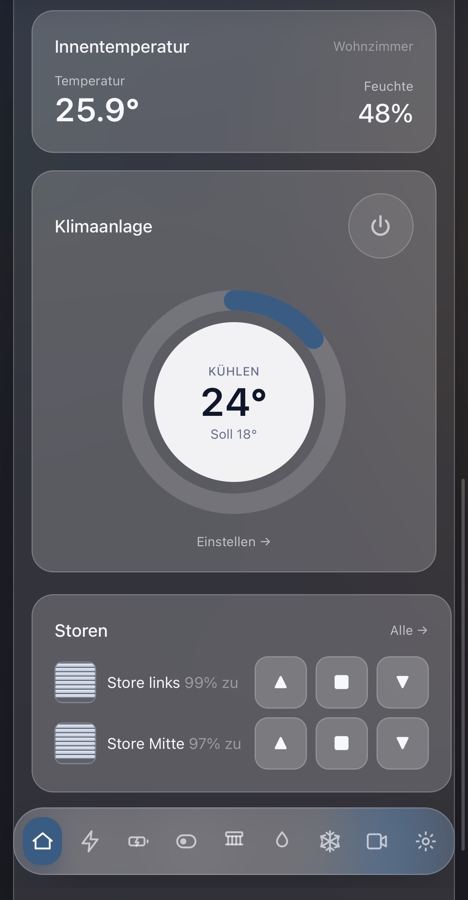
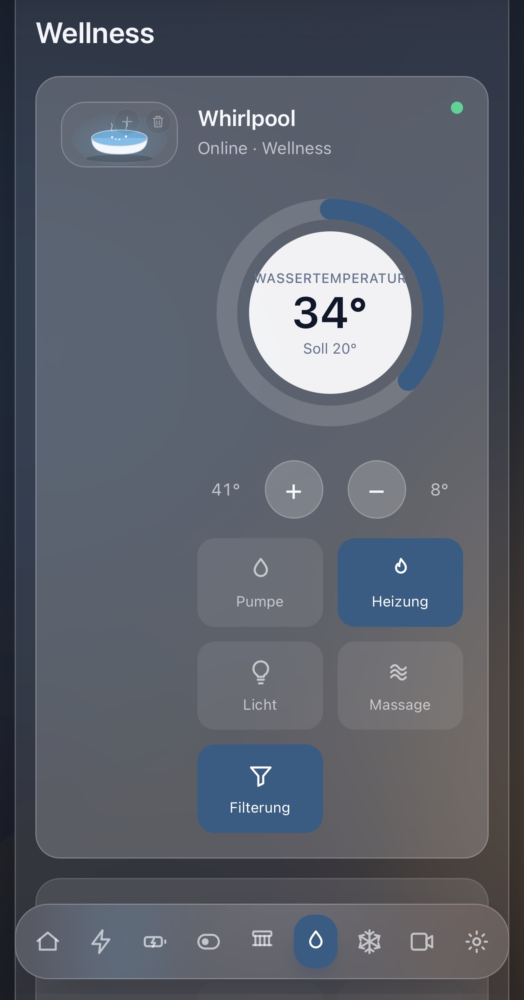

# smarthome

Lokales Smart-Home-Dashboard fürs eigene Heimnetz: Energie, Batterie, Schalter,
Storen, Wellness-Anlagen, Klimaanlage, Umweltsensor, Rauchmelder, Zeitsteuerung,
Kameras, Item-Bilder und Wettervorhersage – auf einem Blick, bedienbar per Browser/iPad.

Ein Deployable (BFF): **Quarkus** (Java 25) + **Angular** (via Quinoa) in einem
Artefakt, **Hexagonal + DDD**, erzwungen durch ArchUnit. Geräte werden **rein lokal
im LAN** angesprochen (keine Hersteller-Cloud nötig). Verbindliche Konventionen:
[`docs/blueprint.md`](docs/blueprint.md).

## Oberfläche

Ein ruhiges, durchgängiges **Glassmorphism**-Design: halbtransparente Karten über
einem dezenten Hintergrund, grosse Touch-Ziele und Ring-Dials für Temperaturen –
gebaut für die Bedienung am iPad oder Smartphone. Drückbare Elemente sinken beim
Antippen wie ein echter Taster ein. Eine Bottom-Bar führt durch die Bereiche
(Übersicht, Energie, Batterie, Schalter, Storen, Wellness, Klima, Kameras, Wetter);
die Glocke oben rechts ist die Nachrichtenzentrale für Geräte-Meldungen.

| Übersicht | Klima & Storen | Wellness |
|:---:|:---:|:---:|
|  |  |  |
| Energiefluss (Erzeugung · Bezug · Haus), Tagesertrag & Selbstversorgung, Wetter | Umweltsensor, Klima-Ring-Dial mit Soll/Ist, Storen mit Auf/Stopp/Zu | Wellness-Anlage: Wassertemperatur-Dial, Funktionen als Taster |

## Schnellstart (ohne Hardware)

```bash
./mvnw quarkus:dev        # Backend :8080 + Angular-Dev-Server :4200
```

- Dashboard: <http://localhost:8080> · API-Beispiel: `/api/energy/current`
- Swagger-UI: `/q/swagger-ui` · Health: `/q/health`
- Im `%dev`/`%test`-Profil sind **Mock-Quellen** aktiv – alles läuft sofort ohne
  Geräte. PostgreSQL kommt über Dev Services (Container-Runtime nötig).

## Lokaler Start

`scripts/dev-mock.sh` startet Quarkus dev – im Mock-Modus (Standard) ganz ohne
Heimnetz, oder mit echten Geräten samt Begleitdiensten. Strg+C beendet alles.

```bash
bash scripts/dev-mock.sh          # nur Mocks – läuft überall, kein Heimnetz nötig
bash scripts/dev-mock.sh --real   # Sidecar (:8765) + go2rtc (:1984) + echte Geräte (dev,live)
```

- **Mock (Standard):** erzwingt `smarthome.real-devices=false` und neutralisiert die
  Geräte-URLs – sticht auch eine lokale `config/application.properties`, die `%dev`
  auf echte Geräte stellen würde. So funkt unterwegs nichts ins (nicht erreichbare) LAN.
- **`--real`** (im Heimnetz): startet zusätzlich den **Sidecar** (Python venv: Tuya
  3.4/3.5, Gecko, Midea) und das **go2rtc**-Kamera-Gateway (Docker, braucht
  `deploy/go2rtc/go2rtc.yaml`). Schon laufende Dienste werden erkannt und nicht
  doppelt gestartet. venv einmalig anlegen:
  `python3 -m venv .tuya-venv && .tuya-venv/bin/pip install -r tools/tuya-sidecar/requirements.txt`

## Use Cases

| # | Bereich | Funktion | Spec |
|---|---------|----------|------|
| 1 | **Energie** | Fronius (Solar-API) & SMARTFOX gegenübergestellt, Hausverbrauch, Tages-/Relativwerte | [energy](docs/energy/SPEC.md) |
| 2 | **Batterie** | SMARTFOX-Relais 1: manuell + PV-Überschuss-Automatik | [battery](docs/battery/SPEC.md) |
| 3 | **Schalter** | Tuya/Smart-Life lokal EIN/AUS (Stehlampe, Palme, Carport, Föhn, Homecinema) | [tuya](docs/tuya/SPEC.md) |
| 4 | **Zeitsteuerung** | Schedule/Countdown/Random/Inching je Schalter (persistiert) | [schedule](docs/schedule/SPEC.md) |
| 5 | **Storen** | Tuya-Cover Auf/Ab/Stopp + Position (UI 100 % = zu, Lamellen-Visualisierung) | [cover](docs/cover/SPEC.md) |
| 6 | **Wellness** | Whirlpool & Schwimmbecken: Pumpe/Heizung/Licht/Massage + Soll-Temperatur | [appliance](docs/appliance/SPEC.md) |
| 7 | **Klimaanlage** | Midea/NetHome Plus lokal: ein/aus, Modus, Soll-/Ist-Temperatur | [climate](docs/climate/SPEC.md) |
| 8 | **Umweltsensor** | Tuya-Temp/Feuchte (nur lesend) | [sensor](docs/sensor/SPEC.md) |
| 9 | **Sicherheit** | Tuya-Rauchmelder: Alarm + Batterie, Nachrichtenzentrale | [safety](docs/safety/SPEC.md) |
| 10 | **Wetter** | Vorhersage (Open-Meteo, kein API-Key) | [weather](docs/weather/SPEC.md) |
| 11 | **Kameras** | Live-Stream im Dashboard (RTSP→WebRTC über go2rtc) | [camera](docs/camera/SPEC.md) |
| – | **Item-Bilder** | Foto je Gerät hinterlegen (serverseitig, geteilt) | [itemimage](docs/itemimage/SPEC.md) |

**Nachrichtenzentrale:** Geräte-Meldungen (Rauchalarm, offline, niedriger Akku) sind
über die Glocke oben rechts einsehbar; ein aktiver Alarm lässt sie rot pulsieren.

## Unterstützte Plattformen & Protokolle

Alle Geräte werden **lokal im LAN** angesprochen – keine Hersteller-Cloud nötig. Jede
Anbindung steckt hinter einem Driven-Port; per Build-Property `smarthome.real-devices`
wird zwischen echtem Adapter und Mock umgeschaltet.

| Plattform / Hersteller | Geräte | Anbindung (lokal) | Use Case |
|------------------------|--------|-------------------|----------|
| **Tuya / Smart Life** | Schalter, Storen, Umweltsensor, Rauchmelder | Tuya-LAN-Protokoll **3.3** nativ in Java (`support/tuya`); **3.4/3.5** über den Sidecar (tinytuya) | 3, 5, 8, 9 |
| **Gecko in.touch2** | Whirlpool & Schwimmbecken (Pumpe/Heizung/Licht/Massage) | WLAN-Steuerung über den Sidecar (geckolib) | 6 |
| **Midea / NetHome Plus** | Klimaanlagen | Midea-LAN-Protokoll (V3 token/key) über den Sidecar (msmart-ng) | 7 |
| **Fronius** | PV-Wechselrichter | Solar API (HTTP/JSON) direkt | 1 |
| **SMARTFOX** | Energiemessung + Relais (Batterieladung) | HTTP (`values.xml` / `setswrel.cgi`) direkt | 1, 2 |
| **RTSP-Kameras** (Tuya/Hankvision-OEM) | IP-Kameras | RTSP (H.265) → WebRTC über das **go2rtc**-Gateway; H.264-Transkodierung für den Browser | 11 |
| **Open-Meteo** | Wettervorhersage | HTTP/JSON, **kein API-Key** | 10 |

Der **Sidecar** (`tools/tuya-sidecar`, Python) bündelt die Bibliotheken, für die es
keine brauchbare Java-Variante gibt (Tuya 3.4/3.5, Gecko, Midea); der Java-Adapter ruft
ihn per HTTP. Tuya 3.3 spricht Java direkt.

**Stand der Geräteanbindung:** Energie, Batterie, Schalter, Storen, Klima, Sensor,
Rauchmelder, Wellness und Kamera sind real angebunden. Geräte ohne vollständige
Konfiguration bleiben automatisch `pending` (offline) und fallen nicht auf Mock zurück.

## Profile

| Profil | Zweck | Geräte | Login |
|--------|-------|--------|-------|
| `%dev` / `%test` | Entwicklung/Tests | Mock | aus |
| `%dev,live` | lokaler Live-Test gegen echte Geräte (Live-Reload, Dev-Services-DB) | echt | aus |
| `%lan` | Heimbetrieb auf Mini-PC/NAS (docker-compose) | echt | aus |
| `%prod` / `%fly` | Cloud (Fly.io) | echt | OIDC |

```bash
./mvnw quarkus:dev -Dquarkus.profile=dev,live   # echte Geräte im LAN testen
```

Mock vs. echt steuert die Build-Property `smarthome.real-devices`. Geräte-Daten
(device-ids, local-keys/Token, IPs, Standort) stehen **ausschliesslich** in der
gitignored `config/application.properties` – Vorlage:
[`config/application.properties.example`](config/application.properties.example).
Im eingecheckten Source stehen nur neutrale Platzhalter.

## Heim-Server (Mini-PC) + iPad als Anzeige

Die App läuft dauerhaft auf einem kleinen Always-on-Linux-Host im LAN; das iPad ist
nur Client (`http://<server-ip>:8080`). Setup per Docker Compose:

```bash
cp config/application.properties.example config/application.properties   # ausfüllen
cd deploy && cp .env.example .env && docker compose up -d --build
```

Details, Voraussetzungen und Provisioning: [`docs/server/SETUP.md`](docs/server/SETUP.md).
Hinweis: NETGEAR ReadyNAS hat kein brauchbares Docker → kleiner Mini-PC/Raspberry Pi
(4 GB+ empfohlen) als Host.

### Sicherer Zugriff von ausserhalb (Remote)

Von unterwegs **mit Login**, **ohne** offenen Router-Port: Ein Fly.io-Login-Proxy
(oauth2-proxy/OIDC) ist öffentlich und erreicht den Heim-Server über eine ausgehende
WireGuard-Verbindung (Fly 6PN). Das Heimnetz bleibt geschlossen.
Setup: [`docs/remote/SETUP.md`](docs/remote/SETUP.md) · Proxy: [`deploy/fly-remote/`](deploy/fly-remote/).

## Architektur

Schicht zuerst, Fachbereich darunter (ein Slice je Use Case):

```
src/main/java/fabianaschwanden/smarthome/
├── domain/model/<slice>          # Records, framework-frei (Invarianten im Compact-Constructor)
├── domain/port/{in,out}/<slice>  # Use-Case- und Driven-Ports
├── domain/service/<slice>        # reine Domain-Services
├── application/service/<slice>   # Use-Case-Orchestrierung
├── adapter/in/rest/<slice>       # JAX-RS Resources (+ dto/<slice>)
├── adapter/out/<slice>/{mock,local,...}  # Geräte-Adapter
└── support/tuya                  # geteiltes Tuya-LAN-Protokoll + Discovery (kein Adapter)
webapp/src/app/features/<slice>/  # Angular-Seiten (Signals, OnPush, native control flow)
```

- Abhängigkeitsrichtung `adapter → application → domain` (ArchUnit bricht den Build).
- Liquibase besitzt das Schema (append-only), Hibernate validiert nur.
- **Sidecar:** Tuya 3.4/3.5, Gecko (Wellness) und Midea (Klima) werden über einen
  kleinen Python-Dienst (`tools/tuya-sidecar`) angebunden, den der Java-Adapter per HTTP
  aufruft. Tuya 3.3 spricht Java direkt; Kameras laufen über das separate go2rtc-Gateway.

## Qualität

```bash
./mvnw verify             # Backend-Tests, ArchUnit, Coverage-Gate, Frontend-Build
cd webapp && npm test     # Frontend-Tests
cd webapp && npm run format:check   # Prettier (wie in der CI)
```

Tests laufen strikt gegen Mocks – ein Hardening-Test stellt sicher, dass im
`%test`-Profil **nie** echte Geräte angesprochen werden.

**Pre-commit-Hook** (formatiert gestagte Frontend-Dateien automatisch mit Prettier,
damit der CI-`format:check` nicht bricht) – einmalig pro Klon aktivieren:

```bash
git config core.hooksPath .githooks
```
